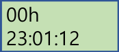

# IUT-Embedded-System-Design-Comprehensive-MidTerm-and-Final-Exam-Replacement-Assignment

## Goal:

> > Digital Alarm Clock using Atmega128 Microcontroller.

## Instruction:

* Make a digital clock with the following functions 1-4
> 1. Mode
> > * Normal time display
> > * Alarm
> > * Stopwatch
> 2. Display method
> > * Normal time 
> > > Line 1: year date / month day  
> > > Line 2: hour(AM/PM), minute, second display
> > > Sample:
> > > 
> 3. Alarm
> > * Free style 
> > * Alarm notice: LED Blinking 
> 4. Stop watch
> > * Free style 
> > * Resolution : 1/100 sec
> > > Sample:
> > > 
* Coded on Atmel studio and simulate with simulIDE
* Atmega128
> * Clock: 14.7456 MHz
> * Port assignment
> > * LED: PortB
> > * Switch: PortD(Mode selection, time setting, stop/go)
> > * Chracter LCD: PortA
* Simulation tool : SimulIDE
> > 
